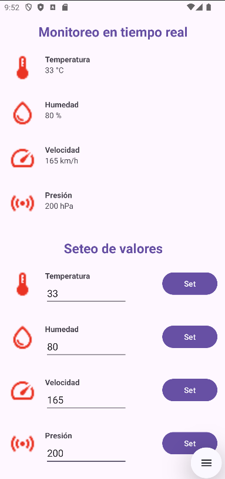

# App9 — Monitoreo en Tiempo Real de Sensores con Firebase Realtime Database


-----

|Campo      |Detalle                                              |
|-----------|-----------------------------------------------------|
|Universidad|Universidad Técnica Estatal de Quevedo (UTEQ)        |
|Facultad   |Facultad de Ciencias de la Computación (FCC)         |
|Carrera    |Software                                             |
|Materia    |Aplicaciones Móviles — SOFT-R-A · 6to Nivel · Corte 2|
|Tema       |Aplicación de monitoreo en tiempo real con Firebase Realtime Database|
|Estudiante |Eduardo Reinoso Vélez                                |

-----

## Objetivo

Implementar un cliente Android que lea y escriba datos en **Firebase Realtime Database** (base de datos NoSQL alojada en la nube que sincroniza los datos entre clientes casi instantáneamente, propagando cada cambio mediante eventos push en lugar de sondeo periódico) para simular el monitoreo de cuatro sensores: temperatura, humedad, presión y velocidad. La interfaz muestra el valor vigente de cada sensor y permite además establecer nuevos valores desde el propio dispositivo, verificando en ambos sentidos la sincronización en tiempo real que ofrece el servicio.

-----

## Tecnologías

|Tecnología / Herramienta|Versión|Propósito                                                 |
|------------------------|-------|----------------------------------------------------------|
|Java                    |11     |Lenguaje principal                                        |
|Android SDK             |API 24–36|Plataforma de ejecución                                 |
|Firebase Realtime Database|21.0.0|Persistencia y sincronización en tiempo real de los valores de sensores|
|Google Services Gradle Plugin|4.4.2|Integra la configuración de Firebase (`google-services.json`) en el build|
|Activity KTX            |1.13.0 |Soporte de ciclo de vida de la actividad                  |
|AppCompat               |1.7.1  |Compatibilidad de componentes de UI                       |
|ConstraintLayout        |2.2.1  |Dependencia de layout incluida en el catálogo de versiones|
|Material Components     |1.14.0 |Componentes visuales base                                 |
|Gradle (catálogo de versiones)|9.2.1|Sistema de construcción con `libs.versions.toml`        |
|Android Studio          |Panda 4.x|IDE de desarrollo                                       |

-----

## Arquitectura

`MainActivity` concentra toda la lógica: mantiene una referencia a la instancia de `FirebaseDatabase` y crea cuatro `DatabaseReference` independientes, una por cada nodo del sensor bajo la ruta `sensores/`. Por cada referencia se registra un `ValueEventListener`, que sigue el patrón de diseño **Observer** (un sujeto notifica automáticamente a sus observadores registrados ante cualquier cambio de estado, sin que estos deban consultarlo activamente) descrito originalmente por Gamma et al. (1994) [1]: cada vez que el valor cambia en la base de datos, en el servidor o desde cualquier otro cliente conectado, `onDataChange()` se dispara y actualiza el `TextView` correspondiente sin intervención del usuario.

```
MainActivity (AppCompatActivity)
├── onCreate()
│   ├── setContentView(activity_main.xml)
│   ├── FirebaseDatabase.getInstance()
│   ├── getReference("sensores/temperatura|humedad|presion|velocidad")
│   └── addValueEventListener(setListener(TextView, unidad))  ← uno por sensor
├── setListener(TextView, unidad)                              ← fábrica de ValueEventListener
│   ├── onDataChange(DataSnapshot)  → txt.setText(valor + unidad)
│   └── onCancelled(DatabaseError)  → txt.setText("")
└── clickBotonTemperatura|Humedad|Velocidad|Presion(View)
    └── <Referencia>.setValue(Float.parseFloat(EditText))      ← escritura hacia Firebase
```

-----

## Estructura del proyecto

```
App9/
├── app/
│   ├── src/
│   │   └── main/
│   │       ├── java/com/uteq/app9/
│   │       │   └── MainActivity.java          # Lectura (listeners) y escritura de los 4 sensores
│   │       ├── res/
│   │       │   ├── layout/
│   │       │   │   └── activity_main.xml      # Bloque de lectura + bloque de seteo por sensor
│   │       │   ├── drawable/                  # Iconos: temperatura, humedad, velocidad, sensor (presión)
│   │       │   └── values/
│   │       │       └── strings.xml
│   │       └── AndroidManifest.xml
│   └── build.gradle                            # Plugin google-services + dependencia firebase-database
├── gradle/
│   └── libs.versions.toml                      # Catálogo central de versiones
├── build.gradle
└── settings.gradle
```

-----

## Funcionalidades implementadas

La pantalla principal se divide en dos bloques verticales. El primero, "Monitoreo en tiempo real", muestra cuatro filas de solo lectura (temperatura, humedad, velocidad y presión) que reflejan el valor almacenado en `sensores/temperatura`, `sensores/humedad`, `sensores/velocidad` y `sensores/presion` respectivamente, con su unidad de medida concatenada (°C, %, km/h, hPa). El segundo bloque, "Seteo de valores", repite los mismos cuatro sensores pero con un `EditText` numérico y un botón "Set" cada uno; al pulsarlo, `clickBotonX()` toma el texto ingresado, lo convierte a `Float` y lo escribe en el nodo correspondiente mediante `setValue()`. Como los cuatro `TextView` de lectura están suscritos con `ValueEventListener`, cualquier escritura —ya sea desde esta misma pantalla, desde otro dispositivo con la app instalada, o directamente desde la consola de Firebase— se refleja de inmediato en todos los clientes conectados, sin necesidad de recargar la actividad ni realizar peticiones manuales.

-----

## Instalación y ejecución

**Requisitos previos:** Android Studio Panda 4, JDK 11, dispositivo o emulador con API 24+ y Google Play Services, y un proyecto propio en [Firebase Console](https://console.firebase.google.com/) con Realtime Database habilitada.

1. Clonar el repositorio:

   ```bash
   git clone https://github.com/ereinosov/App9.git
   ```

1. Abrir la carpeta `App9/` en Android Studio.

1. En Firebase Console, registrar una app Android con el `applicationId` `com.uteq.app9`, descargar el archivo `google-services.json` generado y copiarlo dentro de la carpeta `app/` del proyecto. Este archivo no viene incluido en el repositorio (está excluido vía `.gitignore`) porque contiene claves específicas de cada proyecto de Firebase.

1. En la sección Realtime Database de la consola, crear los nodos `sensores/temperatura`, `sensores/humedad`, `sensores/velocidad` y `sensores/presion` con un valor numérico inicial, y configurar las reglas de lectura/escritura según el entorno (en desarrollo puede usarse acceso abierto; en producción deben restringirse mediante autenticación).

1. Sincronizar Gradle desde **File → Sync Project with Gradle Files**.

1. Ejecutar con **Run → Run 'app'** (`Shift + F10`) sobre un dispositivo o emulador con conexión a internet, necesaria para la sincronización con Firebase.

> Las credenciales de `google-services.json` no deben subirse al repositorio. Cada integrante del equipo debe generar o solicitar su propia copia desde Firebase Console para compilar el proyecto localmente.

-----

## Dependencias principales

```gradle
// app/build.gradle — vía catálogo de versiones (libs.versions.toml)
plugins {
    alias(libs.plugins.android.application)
    alias(libs.plugins.google.gms.google.services)   // com.google.gms.google-services:4.4.2
}

dependencies {
    implementation libs.activity.ktx                  // androidx.activity:activity-ktx:1.13.0
    implementation libs.appcompat                     // androidx.appcompat:appcompat:1.7.1
    implementation libs.constraintlayout              // androidx.constraintlayout:constraintlayout:2.2.1
    implementation libs.firebase.database              // com.google.firebase:firebase-database:21.0.0
    implementation libs.material                       // com.google.android.material:material:1.14.0
}
```

-----

## Capturas de pantalla




-----

*Universidad Técnica Estatal de Quevedo · FCC · Carrera Software · 2026*
