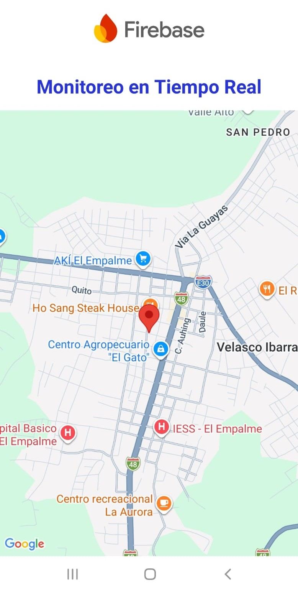
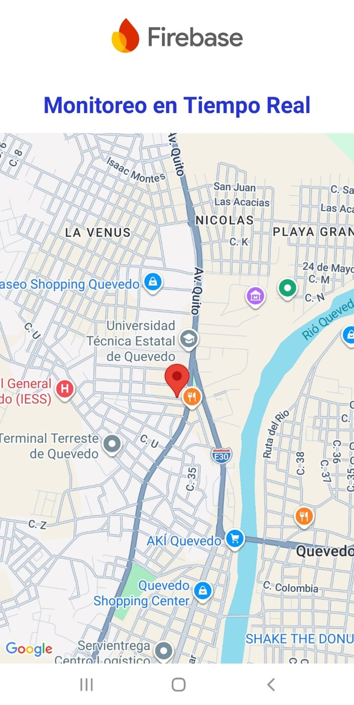

# App9 — Monitoreo de Sensores y Localización GPS en Tiempo Real con Firebase Realtime Database


-----

|Campo      |Detalle                                              |
|-----------|-----------------------------------------------------|
|Universidad|Universidad Técnica Estatal de Quevedo (UTEQ)        |
|Facultad   |Facultad de Ciencias de la Computación (FCC)         |
|Carrera    |Software                                             |
|Materia    |Aplicaciones Móviles — SOFT-R-A · 6to Nivel · Corte 2|
|Tema       |Monitoreo de sensores y localización GPS en tiempo real con Firebase Realtime Database|
|Estudiante |Eduardo Reinoso Vélez                                |

-----

## Objetivo

Implementar un cliente Android que lea y escriba datos en **Firebase Realtime Database** (base de datos NoSQL alojada en la nube que sincroniza los datos entre clientes casi instantáneamente, propagando cada cambio mediante eventos push en lugar de sondeo periódico) para dos escenarios de monitoreo. El primero simula cuatro sensores (temperatura, humedad, presión y velocidad), permitiendo tanto la lectura como el seteo de valores desde el propio dispositivo. El segundo captura la posición geográfica de un vehículo bajo la ruta `vehiculos/GPR250/ubicacion_actual` y la representa dinámicamente como un marcador sobre **Google Maps SDK for Android**, verificando en ambos casos la sincronización bidireccional en tiempo real que ofrece el servicio.

-----

## Tecnologías

|Tecnología / Herramienta|Versión|Propósito                                                 |
|------------------------|-------|----------------------------------------------------------|
|Java                    |11     |Lenguaje principal                                        |
|Android SDK             |API 24–36|Plataforma de ejecución                                 |
|Firebase Realtime Database|21.0.0|Persistencia y sincronización en tiempo real de sensores y coordenadas GPS|
|Google Maps SDK for Android|—    |Renderizado del mapa interactivo y del marcador de posición del vehículo|
|Google Services Gradle Plugin|4.4.2|Integra la configuración de Firebase (`google-services.json`) en el build|
|Activity KTX            |1.13.0 |Soporte de ciclo de vida de la actividad                  |
|AppCompat               |1.7.1  |Compatibilidad de componentes de UI                       |
|ConstraintLayout        |2.2.1  |Dependencia de layout incluida en el catálogo de versiones|
|Material Components     |1.14.0 |Componentes visuales base                                 |
|Gradle (catálogo de versiones)|9.2.1|Sistema de construcción con `libs.versions.toml`        |
|Android Studio          |Panda 4.x|IDE de desarrollo                                       |
|Python 3 + requests     |—      |Script externo que simula el recorrido GPS enviando coordenadas al nodo `ubicacion_actual` vía HTTP PATCH|

-----

## Arquitectura

El proyecto mantiene dos actividades independientes que comparten la misma instancia lógica de `FirebaseDatabase`, pero cada una suscrita a una rama distinta del árbol NoSQL.

**MainActivity** crea cuatro `DatabaseReference` bajo la ruta `sensores/`, una por sensor, y registra en cada una un `ValueEventListener`. Este listener sigue el patrón de diseño **Observer** (un sujeto notifica automáticamente a sus observadores registrados ante cualquier cambio de estado, sin que estos deban consultarlo activamente): cada cambio en el nodo, sea desde otro cliente o desde la propia consola de Firebase, dispara `onDataChange()` y actualiza el `TextView` correspondiente sin intervención del usuario.

```
MainActivity (AppCompatActivity)
├── onCreate()
│   ├── setContentView(activity_main.xml)
│   ├── FirebaseDatabase.getInstance()
│   ├── getReference("sensores/temperatura|humedad|presion|velocidad")
│   └── addValueEventListener(setListener(TextView, unidad))  ← uno por sensor
├── setListener(TextView, unidad)                              ← fábrica de ValueEventListener
│   ├── onDataChange(DataSnapshot)  → txt.setText(valor + unidad)
│   └── onCancelled(DatabaseError)  → txt.setText("")
└── clickBotonTemperatura|Humedad|Velocidad|Presion(View)
    └── <Referencia>.setValue(Float.parseFloat(EditText))      ← escritura hacia Firebase
```

**ActividadMapa** aplica el mismo patrón Observer sobre un único nodo, `vehiculos/GPR250/ubicacion_actual`, y traduce cada notificación en una actualización visual del mapa en lugar de un `TextView`. Este modelo de sincronización mediante notificaciones push entre un servidor y múltiples clientes distribuidos corresponde al paradigma de sistemas distribuidos orientados a eventos. La posición recibida se valida, se transforma en un objeto `LatLng`, y se usa tanto para reposicionar el marcador como para centrar la cámara del mapa.

```
ActividadMapa (AppCompatActivity, OnMapReadyCallback)
├── onCreate()
│   ├── setContentView(activity_actividad_mapa.xml)
│   └── SupportMapFragment.getMapAsync(this)
├── onMapReady(GoogleMap)
│   ├── FirebaseDatabase.getInstance(...)
│   ├── getReference("vehiculos/GPR250/ubicacion_actual")
│   └── addValueEventListener
│       ├── onDataChange(DataSnapshot)
│       │   └── si existen "latitud" y "longitud" → actualizarMarcadorMapa(lat, lon)
│       └── onCancelled(DatabaseError)  → sin acción
├── actualizarMarcadorMapa(lat, lon)
│   ├── remove() del marcador anterior (si existe)
│   ├── addMarker(LatLng) con título "GPR250"
│   └── moveCamera(newLatLngZoom(pos, 15))
└── grabarNuevaPosicionGPS(lat, lon)                            ← escritura opcional hacia Firebase
    └── child("latitud"|"longitud").setValue(...)
```

Las coordenadas que alimentan `ubicacion_actual` durante las pruebas no provienen del GPS físico del dispositivo, sino de un script externo en Python que recorre un arreglo de puntos (extraído de un trazado real entre la casa del estudiante y la UTEQ) y los publica cada 5 segundos mediante `requests.patch()` sobre la URL REST de Firebase, simulando el desplazamiento del vehículo `GPR250`.

-----

## Estructura del proyecto

```
App9/
├── app/
│   ├── src/
│   │   └── main/
│   │       ├── java/com/uteq/app9/
│   │       │   ├── MainActivity.java          # Actividad 1: lectura/escritura de los 4 sensores
│   │       │   └── ActividadMapa.java         # Actividad 2: mapa + marcador sincronizado con Firebase
│   │       ├── res/
│   │       │   ├── layout/
│   │       │   │   ├── activity_main.xml               # Bloque de lectura + bloque de seteo por sensor
│   │       │   │   └── activity_actividad_mapa.xml      # Cabecera Firebase + fragmento de mapa
│   │       │   ├── drawable/                  # Iconos: temperatura, humedad, velocidad, sensor (presión), firebase
│   │       │   └── values/
│   │       │       └── strings.xml
│   │       └── AndroidManifest.xml            # Declara ambas activities y permisos de ubicación e internet
│   └── build.gradle                            # Plugin google-services + dependencias Firebase y Maps SDK
├── gradle/
│   └── libs.versions.toml                      # Catálogo central de versiones
├── build.gradle
└── settings.gradle
```

-----

## Funcionalidades implementadas

**Actividad 1 — Monitoreo de sensores.** La pantalla se divide en dos bloques verticales. El primero, "Monitoreo en tiempo real", muestra cuatro filas de solo lectura (temperatura, humedad, velocidad y presión) que reflejan el valor almacenado en `sensores/temperatura`, `sensores/humedad`, `sensores/velocidad` y `sensores/presion`, con su unidad de medida concatenada (°C, %, km/h, hPa). El segundo bloque, "Seteo de valores", repite los mismos cuatro sensores con un `EditText` numérico y un botón "Set" cada uno; al pulsarlo, `clickBotonX()` convierte el texto ingresado a `Float` y lo escribe en el nodo correspondiente mediante `setValue()`. Como los `TextView` de lectura están suscritos con `ValueEventListener`, cualquier escritura —desde esta pantalla, desde otro dispositivo, o directamente desde la consola de Firebase— se refleja de inmediato en todos los clientes conectados.

**Actividad 2 — Localización GPS en tiempo real.** La pantalla muestra un encabezado con el logotipo de Firebase, el título "Monitoreo en tiempo real" y, debajo, un `SupportMapFragment` de Google Maps que ocupa el resto de la pantalla. Al recibir cada actualización del nodo `ubicacion_actual`, la actividad remueve el marcador anterior, coloca uno nuevo con el título "GPR250" en la posición recibida y centra la cámara sobre él con zoom nivel 15. Durante la prueba documentada, el script de Python publicó el recorrido completo desde la casa del estudiante hasta la UTEQ, permitiendo verificar visualmente el desplazamiento continuo del marcador sobre el mapa desde el punto de partida hasta el punto de llegada.

-----

## Instalación y ejecución

**Requisitos previos:** Android Studio Panda 4, JDK 11, dispositivo o emulador con API 24+ y Google Play Services, un proyecto propio en [Firebase Console](https://console.firebase.google.com/) con Realtime Database habilitada, y una clave de API de Google Maps habilitada en [Google Cloud Console](https://console.cloud.google.com/) para el proyecto.

1. Clonar el repositorio:

   ```bash
   git clone https://github.com/ereinosov/App9.git
   ```

1. Abrir la carpeta `App9/` en Android Studio.

1. En Firebase Console, registrar una app Android con el `applicationId` `com.uteq.app9`, descargar el archivo `google-services.json` generado y copiarlo dentro de la carpeta `app/` del proyecto. Este archivo no viene incluido en el repositorio (está excluido vía `.gitignore`) porque contiene claves específicas de cada proyecto de Firebase.

1. En la sección Realtime Database de la consola, crear los nodos `sensores/temperatura`, `sensores/humedad`, `sensores/velocidad`, `sensores/presion` y `vehiculos/GPR250/ubicacion_actual` (con subcampos `latitud` y `longitud`), y configurar las reglas de lectura/escritura según el entorno (en desarrollo puede usarse acceso abierto; en producción deben restringirse mediante autenticación).

1. Añadir la clave de Google Maps en `AndroidManifest.xml`, en el `meta-data` con `android:name="com.google.android.geo.API_KEY"` (el repositorio mantiene este campo y el `current_key` de `google-services.json` vacíos; cada integrante debe completarlos localmente con su propia clave, sin subir el valor real al control de versiones):

   ```xml
   <meta-data
       android:name="com.google.android.geo.API_KEY"
       android:value="" />
   ```

1. Sincronizar Gradle desde **File → Sync Project with Gradle Files**.

1. Ejecutar con **Run → Run 'app'** (`Shift + F10`) sobre un dispositivo o emulador con conexión a internet, necesaria para la sincronización con Firebase y la carga de tiles de Google Maps.

1. (Opcional) Para reproducir la prueba de recorrido, ejecutar el script `simulador_gps.py` desde una terminal con Python 3 y la librería `requests` instalada, apuntando a la misma URL de Firebase configurada en `ActividadMapa`.

> Las credenciales de `google-services.json` y la clave de Google Maps no deben subirse al repositorio. Cada integrante del equipo debe generar o solicitar su propia copia desde Firebase Console y Google Cloud Console para compilar el proyecto localmente.

-----

## Dependencias principales

```gradle
// app/build.gradle — vía catálogo de versiones (libs.versions.toml)
plugins {
    alias(libs.plugins.android.application)
    alias(libs.plugins.google.gms.google.services)   // com.google.gms.google-services:4.4.2
}

dependencies {
    implementation libs.activity.ktx                  // androidx.activity:activity-ktx:1.13.0
    implementation libs.appcompat                     // androidx.appcompat:appcompat:1.7.1
    implementation libs.constraintlayout              // androidx.constraintlayout:constraintlayout:2.2.1
    implementation libs.firebase.database              // com.google.firebase:firebase-database:21.0.0
    implementation libs.play.services.maps             // com.google.android.gms:play-services-maps
    implementation libs.material                       // com.google.android.material:material:1.14.0
}
```

-----

## Capturas de pantalla

**Actividad 1 — Monitoreo de sensores**


**Actividad 2 — Localización GPS: inicio del monitoreo (casa del estudiante)**



**Actividad 2 — Localización GPS: fin del monitoreo (UTEQ)**



-----

*Universidad Técnica Estatal de Quevedo · FCC · Carrera Software · 2026*